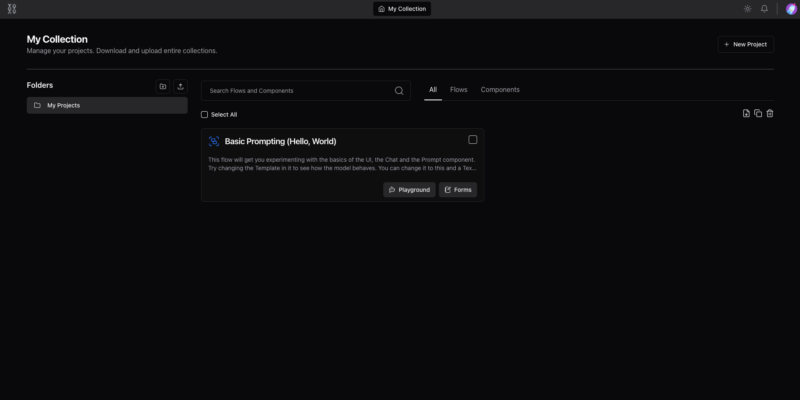

## Introduction {#e12578e9f465459592d89dbe47a54460}

---

Langflow Law is a fork of Langflow and is a new, visual framework for building legal multi-agent and RAG applications. It is open-source, Python-powered, fully customizable, LLM and vector store agnostic.

Its intuitive interface allows for easy manipulation of AI building blocks, enabling developers to quickly prototype and turn their ideas into powerful, real-world solutions.

## 🚀 First steps {#c1ccb5e315b040edaa8d9a67f4960d81}

---

- [Install Langflow Law](/getting-started-installation) - Install and start a local Langflow server.

- [Langflow Workspace](/workspace) - Learn more about the Langflow Workspace.

